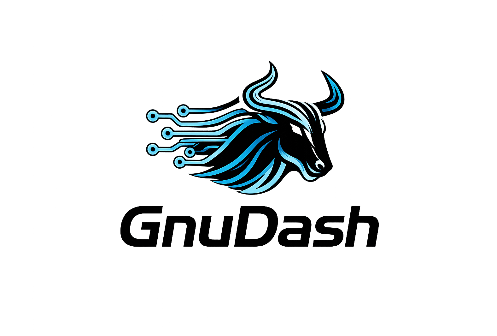
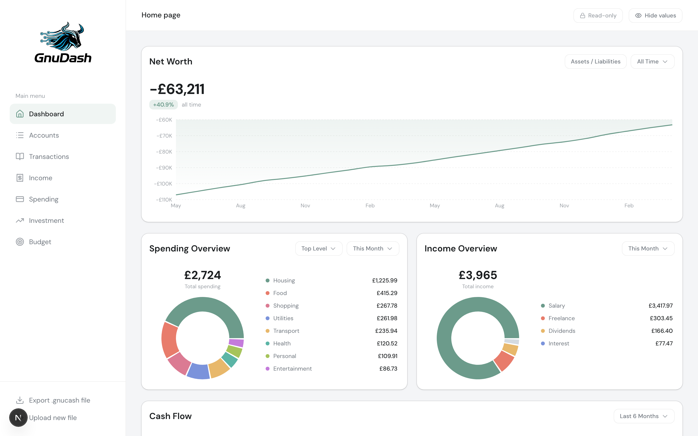
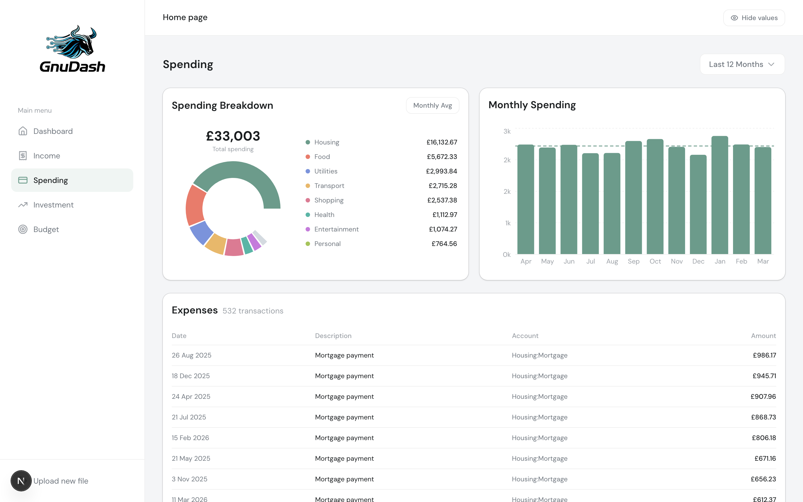
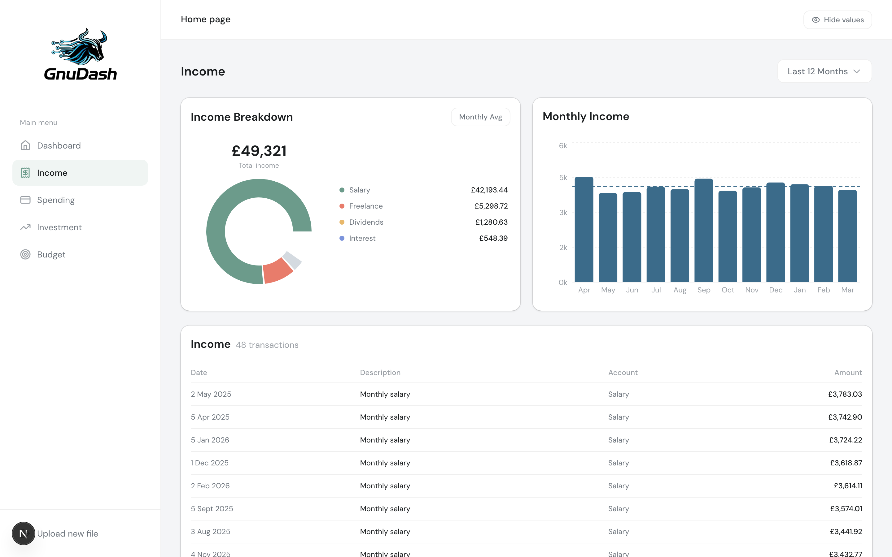
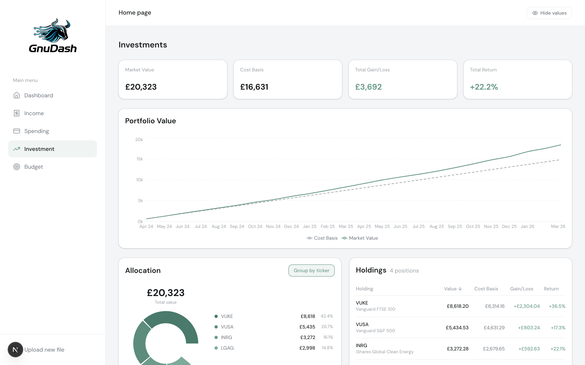
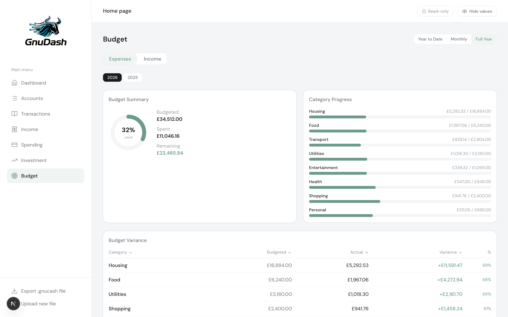
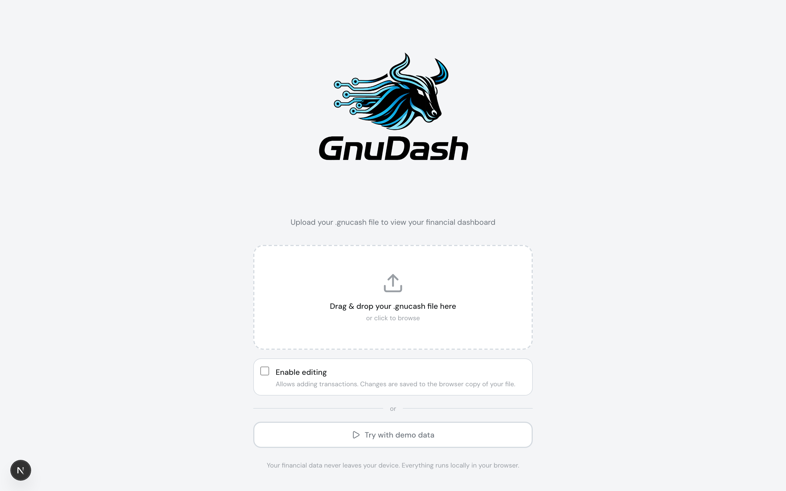

<p align="center">
  
</p>

A personal finance dashboard that reads your GNUCash file and presents your financial data through a clean, interactive UI. Upload your `.gnucash` file, explore your finances — no data stored on the server.

> **Recommended: run locally.** While no data is persisted server-side, running GnuDash on your own machine ensures your financial data never leaves your computer. See [Getting Started](#getting-started) below.


## Features

- **Net Worth** — Track assets minus liabilities over time
- **Cash Flow** — Monthly income/expense bars with net income trend line
- **Spending Breakdown** — Category-level expense analysis with interactive drill-down
- **Account Balances** — Current balances across all accounts
- **Investment Portfolio** — Holdings, allocation, performance, and value over time
- **Budget Tracking** — Budget vs actual with expense/income tabs, YTD variance
- **Recent Transactions** — Searchable transaction history
- **Privacy Mode** — Toggle to blur sensitive numbers on screen
- **Demo Mode** — Try the dashboard instantly with realistic sample data

Charts are fully interactive — click any bar or segment to drill down into breakdowns and individual transactions.

## Screenshots

<table>
  <tr>
    <td><strong>Dashboard</strong></td>
    <td><strong>Spending</strong></td>
  </tr>
  <tr>
    <td></td>
    <td></td>
  </tr>
  <tr>
    <td><strong>Income</strong></td>
    <td><strong>Investment</strong></td>
  </tr>
  <tr>
    <td></td>
    <td></td>
  </tr>
  <tr>
    <td><strong>Budget</strong></td>
    <td><strong>Upload</strong></td>
  </tr>
  <tr>
    <td></td>
    <td></td>
  </tr>
</table>

## Prerequisites

- [Node.js](https://nodejs.org/) 20+
- A GNUCash file saved in **SQLite format** (the default in GNUCash 3.0+)

> To check your file format: in GNUCash, go to **Edit > Preferences > General** and confirm the file format is SQLite3. If you're using XML, save a copy as SQLite via **File > Save As** and select SQLite3.

## Getting Started

```bash
# Clone the repo
git clone https://github.com/QuirkyTurtle94/GnuDash.git
cd GnuDash/app

# Install dependencies
npm install

# Start the dev server
npm run dev
```

Open [http://localhost:3000](http://localhost:3000) and drag-and-drop your `.gnucash` file to get started.

## Production Build

```bash
cd app
npm run build
npm start
```

The app runs on port 3000 by default.

## How It Works

1. You upload a `.gnucash` SQLite file via drag-and-drop
2. The server reads it in-memory using `better-sqlite3`
3. Financial data is extracted and sent to the dashboard
4. **No financial data is persisted** — it's discarded when the session ends

## Tech Stack

| Layer | Technology |
|-------|-----------|
| Framework | Next.js 16 (App Router) |
| Language | TypeScript |
| Styling | Tailwind CSS |
| UI Components | shadcn/ui |
| Charts | Recharts |
| GNUCash Parsing | better-sqlite3 |

## Project Structure

```
app/
├── src/
│   ├── app/              # Next.js pages and API routes
│   │   ├── (dashboard)/  # Dashboard pages (overview, spending, investment, transactions)
│   │   └── api/upload/   # File upload endpoint
│   ├── components/       # React components
│   │   ├── dashboard/    # Dashboard widgets and charts
│   │   ├── spending/     # Spending analysis components
│   │   ├── investment/   # Investment portfolio components
│   │   ├── upload/       # File upload UI
│   │   └── ui/           # shadcn/ui base components
│   └── lib/
│       ├── gnucash/      # GNUCash SQLite parser
│       └── types/        # TypeScript type definitions
docs/
├── gnucash-sql-schema.md # GNUCash SQLite schema reference
└── gnucash-sql-queries.md # SQL query reference
```

## Contributing

Contributions are welcome! Please open an issue first to discuss what you'd like to change.

## License

MIT
