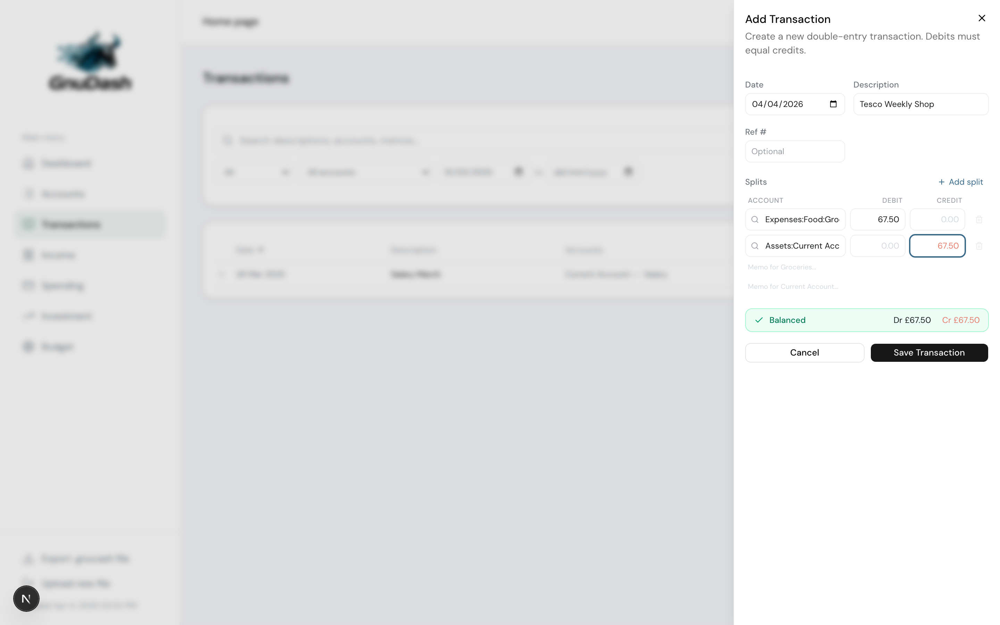
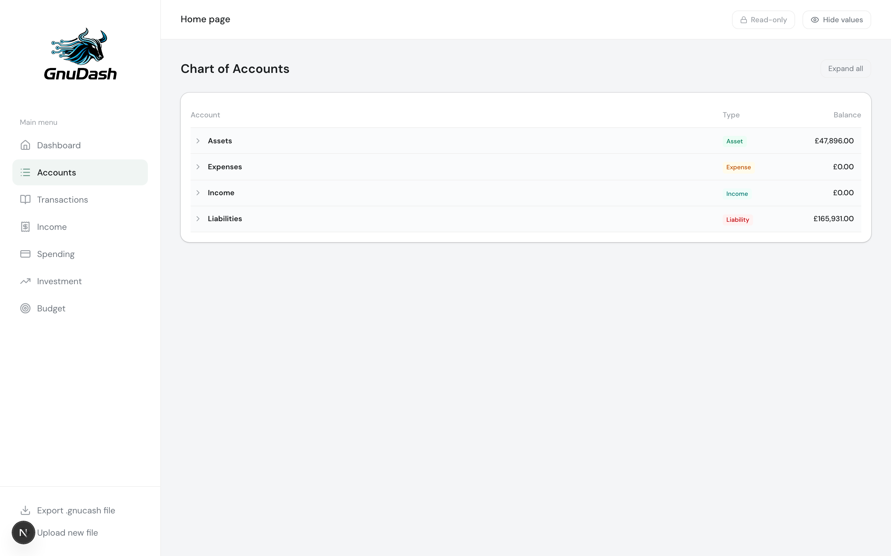

<p align="center">
  
</p>

A personal finance dashboard **for** [GNUCash](https://gnucash.org) users. Upload your `.gnucash` file, explore your finances — everything runs in your browser.

> GnuDash is an independent, community project and is not affiliated with or endorsed by the GNU Project or GNUCash.

**[Try it live](https://gnudash.pages.dev/)** — the app is served as a fully static site. Once the page loads, no data crosses your network. Your `.gnucash` file is read and queried entirely within your browser.


## Your data never leaves your device

GnuDash is a fully client-side application. There is no server interaction with your GNUCash file at any point:

1. You select your `.gnucash` file via drag-and-drop or file picker
2. The file is read directly in your browser using the [File API](https://developer.mozilla.org/en-US/docs/Web/API/File_API)
3. A [Web Worker](https://developer.mozilla.org/en-US/docs/Web/API/Web_Workers_API) loads the file into an in-browser SQLite database powered by [SQLite WASM](https://sqlite.org/wasm) — the official WebAssembly build of SQLite
4. All SQL queries run locally inside the Worker, producing the same results as a native SQLite client
5. The database is stored in your browser's [Origin Private File System (OPFS)](https://developer.mozilla.org/en-US/docs/Web/API/File_System_API/Origin_private_file_system), so it **persists across sessions** — you don't need to re-upload your file each time you visit
6. No data is ever sent to a server. The entire app is a static site with no backend.

To clear your data, use the dashboard's clear/reset option or clear your browser's site data.

## Features

- **Net Worth** — Track assets minus liabilities over time
- **Cash Flow** — Monthly income/expense bars with net income trend line
- **Spending Breakdown** — Category-level expense analysis with interactive drill-down
- **Income Analysis** — Income sources with drill-down and monthly trends
- **Account Balances** — Current balances across all accounts
- **Investment Portfolio** — Holdings, allocation, performance, and value over time
- **Budget Tracking** — Budget vs actual with expense/income tabs, YTD variance
- **Transaction Ledger** — Searchable, sortable transaction history with split details
- **Transaction Editing** — Add, edit, and delete transactions with full double-entry enforcement
- **Investment Transactions** — Buy/sell stocks with shares, price, and total (auto-calculates any 2 of 3)
- **Accounting Engine** — Rational arithmetic (no floating point), multi-currency, GNUCash-compatible writes
- **Export** — Download your modified `.gnucash` file for use in GNUCash desktop
- **Privacy Mode** — Toggle to blur sensitive numbers on screen
- **Demo Mode** — Try the dashboard instantly with realistic sample data

Charts are fully interactive — click any bar or segment to drill down into breakdowns and individual transactions. Transaction editing uses the same GNUCash SQLite schema, so exported files open seamlessly in GNUCash desktop.

## Screenshots

<table>
  <tr>
    <td><strong>Dashboard</strong></td>
    <td><strong>Spending</strong></td>
  </tr>
  <tr>
    <td></td>
    <td></td>
  </tr>
  <tr>
    <td><strong>Income</strong></td>
    <td><strong>Investment</strong></td>
  </tr>
  <tr>
    <td></td>
    <td></td>
  </tr>
  <tr>
    <td><strong>Budget</strong></td>
    <td><strong>Transactions</strong></td>
  </tr>
  <tr>
    <td></td>
    <td></td>
  </tr>
  <tr>
    <td><strong>Accounts</strong></td>
    <td><strong>Upload</strong></td>
  </tr>
  <tr>
    <td></td>
    <td></td>
  </tr>
</table>

## Prerequisites

- [Node.js](https://nodejs.org/) 20+
- A GNUCash file saved in **SQLite format** (the default in GNUCash 3.0+)

> To check your file format: in GNUCash, go to **Edit > Preferences > General** and confirm the file format is SQLite3. If you're using XML, save a copy as SQLite via **File > Save As** and select SQLite3.

## Getting Started

```bash
# Clone the repo
git clone https://github.com/QuirkyTurtle94/GnuDash.git
cd GnuDash/app

# Install dependencies
npm install

# Start the dev server
npm run dev
```

Open [http://localhost:3000](http://localhost:3000) and drag-and-drop your `.gnucash` file to get started.

## Deployment

GnuDash is a fully static site — no backend server required. See the **[Deployment Guide](docs/deployment.md)** for full instructions covering Docker, Cloudflare Pages, Vercel, Netlify, Coolify, and more.

## Tech Stack

| Layer | Technology |
|-------|-----------|
| Framework | Next.js 16 (App Router, static export) |
| Language | TypeScript |
| Styling | Tailwind CSS |
| UI Components | shadcn/ui |
| Charts | Recharts |
| Database | SQLite WASM (client-side, in-browser) |
| Persistence | Origin Private File System (OPFS) |

## Project Structure

```
app/
├── src/
│   ├── app/              # Next.js pages
│   │   └── (dashboard)/  # Dashboard pages (overview, spending, investment, etc.)
│   ├── components/       # React components
│   │   ├── dashboard/    # Dashboard widgets and charts
│   │   ├── spending/     # Spending analysis components
│   │   ├── investment/   # Investment portfolio components
│   │   ├── upload/       # File upload UI
│   │   └── ui/           # shadcn/ui base components
│   └── lib/
│       ├── gnucash/      # GNUCash SQLite parser and domain logic
│       │   ├── db/       # Database adapters (WASM + better-sqlite3 for tests)
│       │   ├── domain/   # Read-only business logic modules (accounts, net-worth, etc.)
│       │   ├── engine/   # Accounting engine (write operations)
│       │   │   ├── builders/    # TransactionBuilder, AccountBuilder
│       │   │   ├── db/          # WritableDbAdapter (WASM + better-sqlite3)
│       │   │   ├── operations/  # CRUD operations (transactions, accounts, prices, lots)
│       │   │   └── validation/  # Double-entry invariants and account rules
│       │   ├── worker/   # Web Worker for client-side SQLite execution
│       │   └── shared/   # Shared utilities (dates, account paths)
│       └── types/        # TypeScript type definitions
docs/
├── gnucash-sql-schema.md # GNUCash SQLite schema reference
└── gnucash-sql-queries.md # SQL query reference
```

## Contributing

Contributions are welcome! Please [open an issue](https://github.com/QuirkyTurtle94/GnuDash/issues) first to discuss what you'd like to change before submitting a pull request. This helps avoid duplicate effort and keeps the project on track.

See [CONTRIBUTING.md](CONTRIBUTING.md) for full guidelines on setting up the project, submitting changes, and reporting bugs.

## License

MIT
