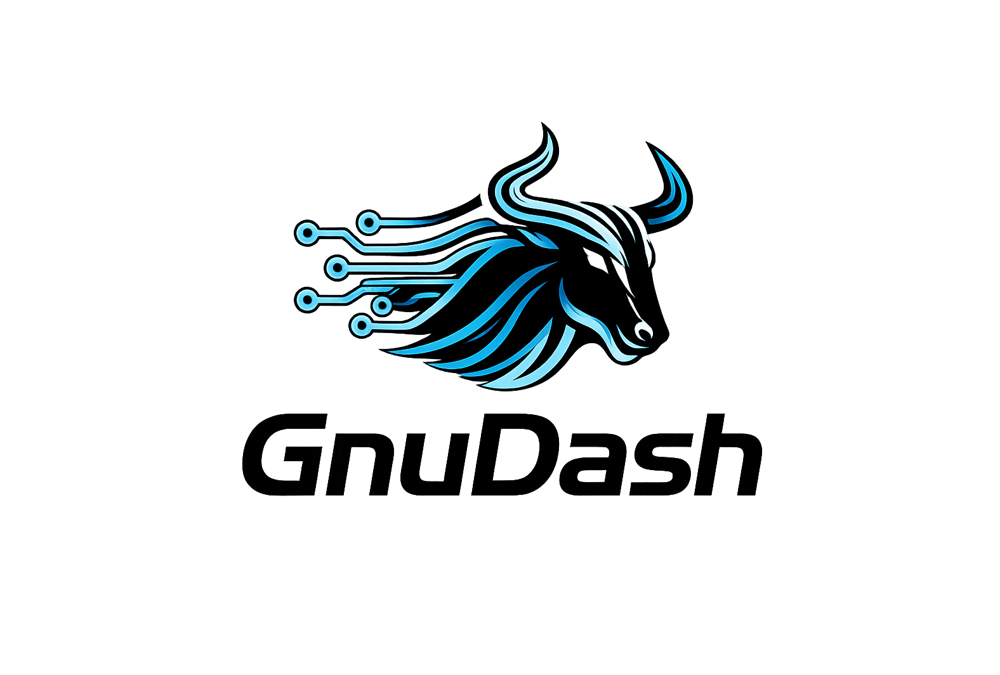
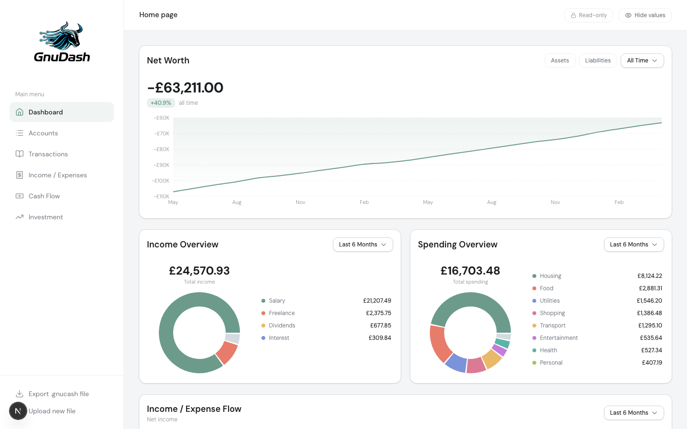
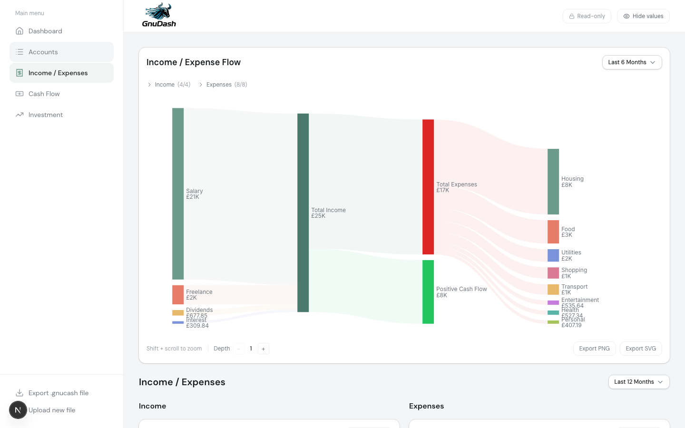
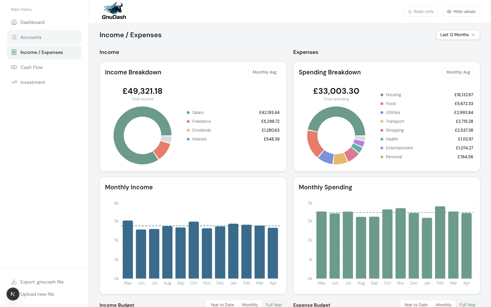
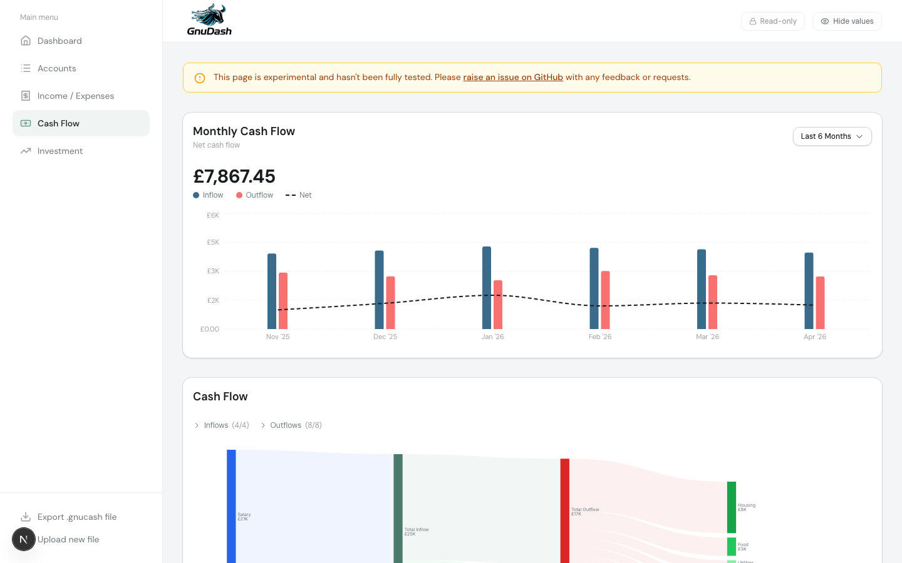
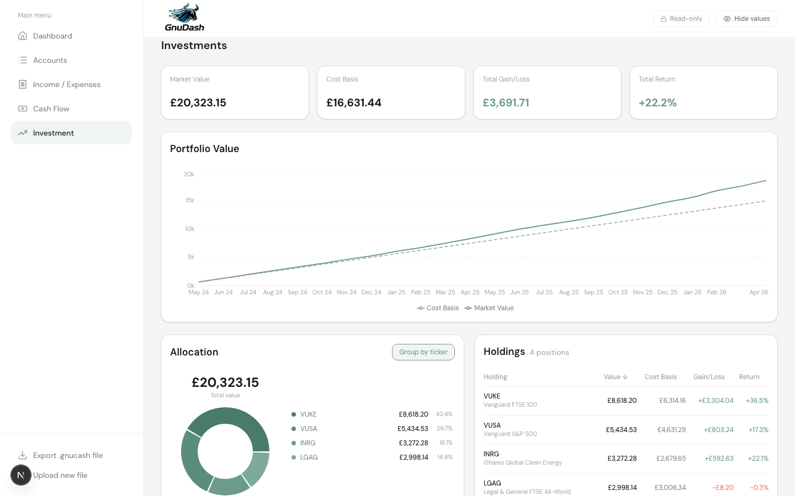
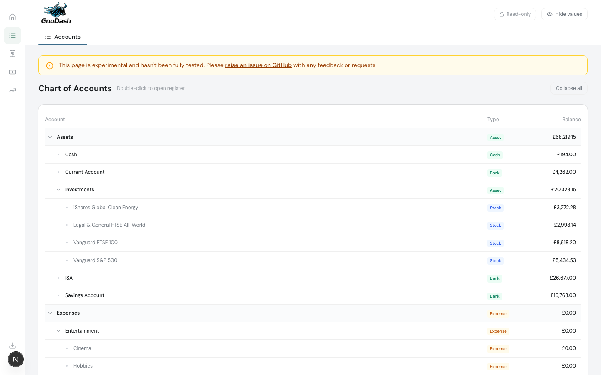

<p align="center">
  
</p>

A personal finance dashboard **for** [GNUCash](https://gnucash.org) users. Upload your `.gnucash` file (SQLite or XML), explore and edit your finances — everything runs in your browser.

> GnuDash is an independent, community project and is not affiliated with or endorsed by the GNU Project or GNUCash.

**[Try it live](https://gnudash.pages.dev/)** — the app is served as a fully static site. Once the page loads, no data crosses your network. Your `.gnucash` file is read and queried entirely within your browser.


## Your data never leaves your device

GnuDash is a fully client-side application. There is no server interaction with your GNUCash file at any point:

1. You select your `.gnucash` file via drag-and-drop or file picker
2. The file is read directly in your browser using the [File API](https://developer.mozilla.org/en-US/docs/Web/API/File_API)
3. The app auto-detects the file format (SQLite, XML, or gzip-compressed variants) and loads it into an in-browser SQLite database powered by [SQLite WASM](https://sqlite.org/wasm) via a [Web Worker](https://developer.mozilla.org/en-US/docs/Web/API/Web_Workers_API)
4. All SQL queries run locally inside the Worker, producing the same results as a native SQLite client
5. The database is stored in your browser's [Origin Private File System (OPFS)](https://developer.mozilla.org/en-US/docs/Web/API/File_System_API/Origin_private_file_system), so it **persists across sessions** — you don't need to re-upload your file each time you visit
6. No data is ever sent to a server. The entire app is a static site with no backend.

To clear your data, use the dashboard's clear/reset option or clear your browser's site data.

### Optional: self-hosted Server backend

If you want the same book accessible from every device you use — phone, laptop, work machine — you can self-host GnuDash against your own Postgres database instead of relying on the per-browser OPFS cache. Pick **Server (Postgres)** on the upload screen, point it at your database, and GnuDash mirrors the book into a dedicated schema there. Writes round-trip to Postgres before the UI shows the "saved" state; reads hit a local SQLite WASM cache so the dashboard stays fast.

You can also point GnuDash at an existing GnuCash desktop Postgres database in **read-only** mode — useful if you just want a browser dashboard over data you're already writing from the desktop app.

This mode requires the standalone Node.js build (the static `gnudash.pages.dev` deployment stays fully local-only). The fastest way to try it:

```bash
git clone https://github.com/QuirkyTurtle94/GnuDash.git
cd GnuDash
docker compose up -d                     # gnudash + Postgres together
open http://localhost:3000
```

Full walkthrough — reverse-proxy / TLS, existing-GnuCash read-only mode, troubleshooting — in the [Deployment Guide](docs/deployment.md).

## Features

### Dashboard & Reports
- **Net Worth** — Track assets minus liabilities over time with trend charts
- **Income / Expenses** — Sankey flow diagrams, category breakdowns (pie charts), monthly trend bars, and budget tracking in a single combined view
- **Cash Flow** — Monthly inflow/outflow bars with net trend line, cash flow Sankey diagram, and budget vs actual
- **Investment Portfolio** — Holdings table, allocation pie chart, performance metrics, price history, and portfolio value over time
- **Budget Tracking** — Budget vs actual with expense/income tabs, YTD variance, drill-down by category, and unbudgeted spend detection

### Accounts & Transactions
- **Chart of Accounts** — Hierarchical account tree with balances, expand/collapse, and account type indicators
- **Inline Transaction Register** — Double-click any account to open its GnuCash-style transaction register in a tab
- **Transaction Editing** — Add, edit, and delete transactions with full double-entry enforcement — all inline, no modals
- **Investment Transactions** — Buy/sell stocks with shares, price, and total (auto-calculates any 2 of 3)
- **Account Management** — Create and edit accounts with type, currency, and parent assignment

### Engine & Data
- **Accounting Engine** — Rational arithmetic (no floating point), multi-currency, GNUCash-compatible writes
- **SQLite & XML** — Supports both GNUCash file formats (including gzip-compressed); XML files open as read-only
- **OPFS Persistence** — Your database is stored in your browser's Origin Private File System, so it persists across sessions without re-uploading
- **Self-hosted Postgres backend** — Optional alternative storage for cross-device access: every write is cache-and-synced to a Postgres schema you control, with auto-reconnect on app load. See the [Deployment Guide](docs/deployment.md).
- **Multi-Currency** — Switch display currency across all views when your file contains multiple currencies
- **Closing Transactions** — Toggle to exclude period-end closing entries from reports
- **Export** — Download your modified `.gnucash` file for use in GNUCash desktop
- **Privacy Mode** — Toggle to blur sensitive numbers on screen
- **Demo Mode** — Try the dashboard instantly with realistic sample data

Charts are fully interactive — click any bar or segment to drill down into breakdowns and individual transactions. The accounts page uses a tabbed, GnuCash-style interface where double-clicking an account opens its transaction register in a new tab. Transaction editing uses the same GNUCash SQLite schema, so exported files open seamlessly in GNUCash desktop.

## Screenshots

<table>
  <tr>
    <td><strong>Dashboard</strong></td>
    <td><strong>Income / Expense Sankey</strong></td>
  </tr>
  <tr>
    <td></td>
    <td></td>
  </tr>
  <tr>
    <td><strong>Spending Breakdown</strong></td>
    <td><strong>Cash Flow</strong></td>
  </tr>
  <tr>
    <td></td>
    <td></td>
  </tr>
  <tr>
    <td><strong>Investment Portfolio</strong></td>
    <td><strong>Accounts & Transactions</strong></td>
  </tr>
  <tr>
    <td></td>
    <td></td>
  </tr>
</table>

## Prerequisites

- [Node.js](https://nodejs.org/) 20+
- A GNUCash `.gnucash` file — both **SQLite** and **XML** formats are supported (including gzip-compressed files)

> XML files open as read-only. To enable editing and export, use a SQLite file (the default in GNUCash 3.0+). You can convert via **File > Save As** and selecting SQLite3.

## Getting Started

```bash
# Clone the repo
git clone https://github.com/QuirkyTurtle94/GnuDash.git
cd GnuDash/app

# Install dependencies
npm install

# Start the dev server
npm run dev
```

Open [http://localhost:3000](http://localhost:3000) and drag-and-drop your `.gnucash` file to get started.

## Deployment

GnuDash ships two deployment modes:

- **Static** (the default public [gnudash.pages.dev](https://gnudash.pages.dev/) deployment): build with `NEXT_OUTPUT=export npm run build` and host the `out/` folder on any static CDN (Cloudflare Pages, Netlify, the included nginx Dockerfile, a plain web server). The Local (OPFS) storage backend is the only option in this mode; nothing leaves your browser.
- **Standalone Node.js** (default `npm run build`): run the built app on a Node.js server. This unlocks the optional Server (Postgres) backend ([issue #48](https://github.com/QuirkyTurtle94/GnuDash/issues/48)) for sharing a book across devices, while keeping the Local backend fully functional.

See the **[Deployment Guide](docs/deployment.md)** for step-by-step instructions for both modes covering Docker, Cloudflare Pages, Vercel, Netlify, Coolify, Synology, and more.

## Tech Stack

| Layer | Technology |
|-------|-----------|
| Framework | Next.js 16 (App Router, static export) |
| Language | TypeScript |
| Styling | Tailwind CSS |
| UI Components | shadcn/ui |
| Charts | Recharts, ECharts (Sankey) |
| Database | SQLite WASM (client-side, in-browser) |
| Persistence | Origin Private File System (OPFS) |

## Project Structure

```
app/
├── src/
│   ├── app/              # Next.js pages
│   │   └── (dashboard)/  # Dashboard pages (overview, accounts, income-expenses, cash-flow, investment)
│   ├── components/       # React components
│   │   ├── account-*/    # Account management (create, edit, tree view)
│   │   ├── budget/       # Budget tracking components
│   │   ├── dashboard/    # Dashboard widgets, charts, and sidebar
│   │   ├── inline-entry/ # GnuCash-style inline transaction entry
│   │   ├── investment/   # Investment portfolio components
│   │   ├── sankey/       # Sankey diagram components
│   │   ├── spending/     # Spending analysis components
│   │   ├── upload/       # File upload UI
│   │   └── ui/           # shadcn/ui base components
│   └── lib/
│       ├── gnucash/      # GNUCash parser and domain logic
│       │   ├── db/       # Database adapters (WASM + better-sqlite3 for tests)
│       │   ├── domain/   # Read-only business logic modules (accounts, net-worth, cash-flow, etc.)
│       │   ├── engine/   # Accounting engine (write operations)
│       │   │   ├── builders/    # TransactionBuilder, AccountBuilder
│       │   │   ├── db/          # WritableDbAdapter (WASM + better-sqlite3)
│       │   │   ├── operations/  # CRUD operations (transactions, accounts, prices, lots)
│       │   │   └── validation/  # Double-entry invariants and account rules
│       │   ├── xml/      # GNUCash XML format parser
│       │   ├── worker/   # Web Worker for client-side SQLite execution
│       │   └── shared/   # Shared utilities (dates, account paths)
│       └── types/        # TypeScript type definitions
├── scripts/              # Playwright screenshot automation
docs/
├── gnucash-sql-schema.md # GNUCash SQLite schema reference
└── gnucash-sql-queries.md # SQL query reference
```

## Contributing

Contributions are welcome! Please [open an issue](https://github.com/QuirkyTurtle94/GnuDash/issues) first to discuss what you'd like to change before submitting a pull request. This helps avoid duplicate effort and keeps the project on track.

See [CONTRIBUTING.md](CONTRIBUTING.md) for full guidelines on setting up the project, submitting changes, and reporting bugs.

## License

MIT
