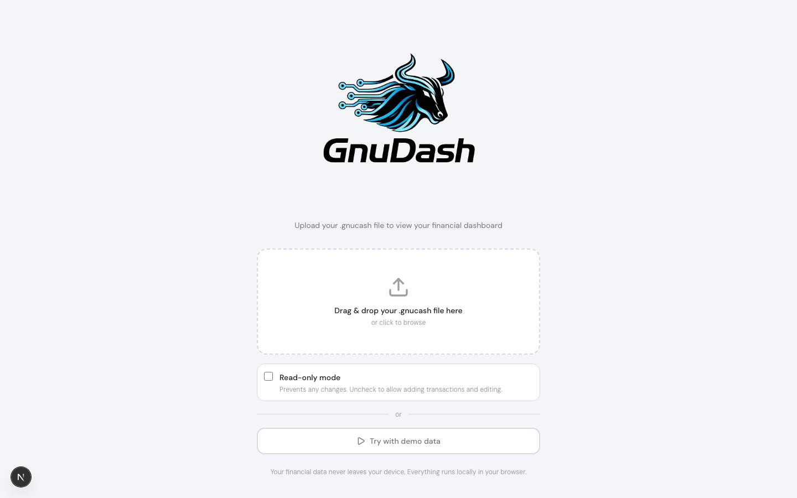
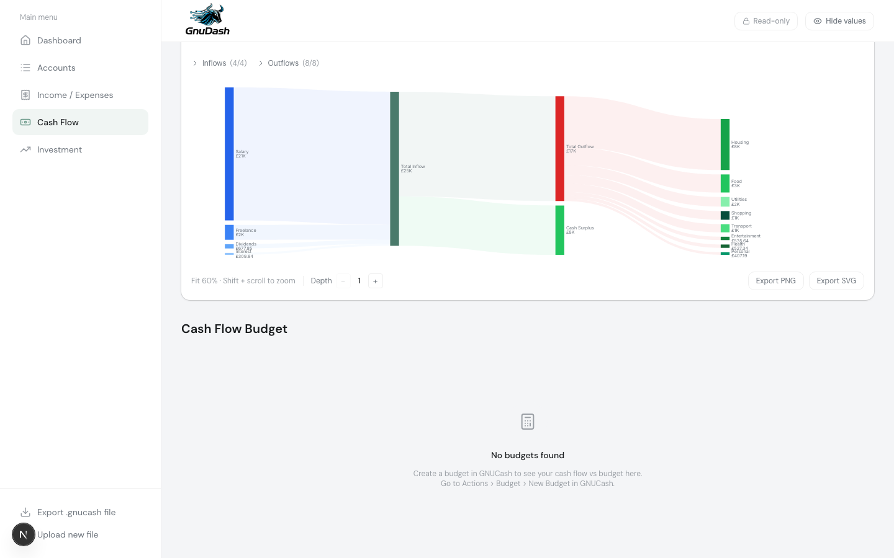

# GnuDash User Guide

GnuDash is a browser dashboard for GNUCash books. It can open an existing `.gnucash`
file, show reports across the book, and, when the source supports it, let you edit
accounts, transactions, budgets, prices, and securities from the browser.

The public hosted app runs entirely in your browser. Your local GNUCash file is read
with browser APIs, queried through SQLite WASM in a Web Worker, and persisted in the
browser's Origin Private File System (OPFS). No book data is uploaded to a GnuDash
server in the default local mode.

## Contents

- [Quick start](#quick-start)
- [Load or create a book](#load-or-create-a-book)
- [Navigate the app](#navigate-the-app)
- [Dashboard](#dashboard)
- [Income and expenses](#income-and-expenses)
- [Cash flow](#cash-flow)
- [Budgets](#budgets)
- [Investments](#investments)
- [Accounts and transactions](#accounts-and-transactions)
- [Special functions](#special-functions)
- [Global controls](#global-controls)
- [Supported data sources](#supported-data-sources)
- [Troubleshooting and FAQ](#troubleshooting-and-faq)

## Quick start

1. Open GnuDash.
2. Choose **Local file**.
3. Drop a `.gnucash` file onto the upload area, or click the upload area and pick one.
4. Leave **Read-only mode** unchecked if you want to add or edit data. Check it if you
   only want to inspect the book.
5. Use the left sidebar to move between dashboard pages.
6. Use **Export .gnucash file** from the bottom of the sidebar after making local edits.

If you do not want to use your own data yet, choose **Try demo**. If you want to start
a new book in GnuDash, choose **Start fresh**.

## Load or Create a Book

### Local File

The local file flow is the safest starting point. GnuDash reads the selected file
inside the browser and stores the loaded database in OPFS so the same browser can
reopen it later without another upload.

Use local mode when:

- You want all book data to remain on the current device.
- You are using the public static deployment.
- You want to export a modified `.gnucash` file back to GNUCash desktop.

Local uploads accept `.gnucash` files up to 200 MB. Files saved as SQLite can be
opened read-write when read-only mode is off. XML books are opened read-only.

### Server (Postgres)

Self-hosted standalone deployments can also show a **Server (Postgres)** tab. This
mode is not available on the public static deployment because it needs API routes.

The server tab supports two patterns:

- **GnuDash-managed book**: GnuDash owns a dedicated Postgres schema for a book ID.
  Use this when you want the same book available from multiple browsers or devices.
- **Existing GNUCash database**: GnuDash connects to a schema maintained by GNUCash
  desktop, usually `public`. This is read-only in GnuDash so GNUCash desktop remains
  the source of truth.

See the [Deployment Guide](deployment.md) for setup, reverse proxy, TLS, and
Postgres troubleshooting.

### Start Fresh and Demo

**Start fresh** creates a new book with a starter account structure. Use it when you
want to begin tracking in GnuDash rather than importing an existing GNUCash file.

**Try demo** loads generated sample data so you can explore reports and editing
without using personal data.

## Navigate the App

The sidebar contains the main sections:

- **Dashboard**: net worth, income, spending, cash flow, assets, liabilities, and
  top balances.
- **Accounts**: chart of accounts, registers, and account/transaction editing.
- **Income / Expenses**: income and expense trends, Sankey flow, category analysis,
  transaction tables, and budget views.
- **Cash Flow**: cash inflow/outflow trends, cash flow Sankey, and cash budget views.
- **Investment**: holdings, allocation, value over time, and price database.
- **Special functions**: bulk edit and budget maintenance tools.

On desktop, the sidebar expands when hovered. On mobile, use the menu button in the
top bar.

## Dashboard

The dashboard is the high-level view of the book.

It includes:

- **Net Worth**: assets minus liabilities over time.
- **Income Overview** and **Spending Overview**: category totals for the selected
  period. Click drillable categories to move deeper into account paths.
- **Net Income**: income, expenses, and net movement across months.
- **Assets** and **Liabilities**: balance pie charts by account type or account group.
- **Top Balances**: a table of major account balances.

Use the period controls on report cards to switch between built-in ranges or a custom
month range. Some cards share period state so income, spending, and net income stay
aligned while you compare them.

## Income and Expenses

The **Income / Expenses** page focuses on category-level reporting.

Use it to answer questions such as:

- Which income sources funded which expense groups?
- Which expense categories changed over time?
- Which transactions make up a chart segment?
- How actual spending compares with a GNUCash budget.

Main tools:

- **Monthly income vs expense**: compares income, expense, net result, and savings
  rate for the selected period.
- **Sankey diagram**: shows income flowing through to expense categories. Use the
  period selector, category filters, and depth slider to adjust the diagram.
- **Spending and income cards**: pie charts, monthly bars, and sortable category
  tables. Clicking a category filters related cards and transaction tables.
- **Transaction tables**: list the underlying income or expense transactions for the
  current context.
- **Budget panels**: compare actuals against budgeted amounts for expense or income
  categories.

## Cash Flow

The **Cash Flow** page uses cash account movement rather than income/expense account
classification.

It includes:

- **Monthly Cash Flow**: inflow, outflow, and net cash movement by month.
- **Cash Flow Sankey**: flow from inflow categories through cash accounts to outflow
  categories.
- **Inflows and outflows filters**: choose which top-level categories are included in
  the Sankey.
- **Depth control**: expand or collapse account hierarchy detail in the diagram.
- **Budget views**: compare cash movement against budget categories where available.

This page is useful when account movement matters more than profit-and-loss reporting,
for example savings transfers, loan payments, or cash account changes.

## Budgets

GnuDash can read GNUCash budgets and can edit budgets from **Special functions >
Budgets** when the book is writable.

Budget reporting appears in the **Income / Expenses** and **Cash Flow** pages:

- Use the budget selector when a book contains more than one budget.
- Toggle yearly or monthly views.
- Pick the year or month to inspect.
- Click parent categories to drill into child categories.
- Review summary cards, progress bars, and variance tables.
- Watch for imbalance banners when an explicit parent budget differs from the sum of
  child budgets.

The budget editor lets you create budgets against the chart of accounts, set amounts
for any period, and update or delete existing budgets.

## Investments

The **Investment** page appears when the book contains investment accounts such as
stock or mutual fund accounts.

It includes:

- **Portfolio summary**: current market value, cost basis, gain/loss, and return.
- **Value over time**: portfolio value series using available price history.
- **Allocation pie**: allocation by ticker or by account, with a grouping toggle.
- **Holdings table**: shares held, cost basis, market value, and gain/loss.
- **Prices table**: add, edit, or delete price records when the book is writable.

Price history and market values depend on the prices stored in the GNUCash book.
GnuDash does not fetch live market prices.

## Accounts and Transactions

The **Accounts** page is a chart of accounts plus a tabbed register interface.

Use the chart of accounts to:

- Expand or collapse account groups.
- Review balances in each account's native currency.
- Add, edit, or delete accounts when editing is enabled.
- Single-click a leaf account to open its register.
- Double-click a parent account to open its register.

In a register, you can:

- Search by description, number, account, transfer account, or memo.
- Sort by date, description, transfer, or amount.
- Add a new transaction from the inline entry row.
- Edit, duplicate, or delete existing transactions when the book is writable.
- Expand transactions to inspect split details.
- Enter investment transactions with shares, price, and total fields. GnuDash can
  calculate the missing value when two of the three are supplied.

GnuDash enforces double-entry balance rules before saving transactions. XML books,
read-only local books, and existing GNUCash Postgres databases do not show write
actions.

## Special Functions

The **Special functions** page groups tools that are useful for cleanup or advanced
maintenance.

- **Bulk edit transactions**: group simple two-posting transactions by description,
  then rename or reassign accounts across a whole group. This is intended for
  cleanup after imports.
- **Budgets**: create and maintain budgets directly in GnuDash.

These tools can make broad changes. Export or back up the book before using them on
important data.

## Global Controls

The top bar and sidebar contain controls that affect the whole app.

- **Editing / Read-only**: toggle write access for writable local or managed
  Postgres books. Read-only sources stay locked.
- **Exclude closing**: when closing transactions are detected, hide them from reports
  that support closing-aware calculations.
- **Currency selector**: switch the display currency when the book contains multiple
  currencies. Reports use the conversion data available in the GNUCash book.
- **Hide values**: privacy mode blurs balances, amounts, descriptions, labels,
  tickers, and chart labels for screen sharing.
- **Theme toggle**: switch between light and dark display.
- **Export .gnucash file**: download the current local/writable book for use in
  GNUCash desktop.
- **Upload new file / Disconnect**: clear the current session and return to the load
  screen.

## Supported Data Sources

| Source | Reporting | Editing | Notes |
| --- | --- | --- | --- |
| SQLite `.gnucash` local file | Yes | Yes, unless read-only mode is selected | Default GNUCash 3.0+ format. Export after edits. |
| XML `.gnucash` local file | Yes | No | Re-save as SQLite3 in GNUCash desktop to edit. |
| Gzip-compressed GNUCash files | Yes | Depends on underlying format | GnuDash auto-detects compressed variants. |
| GnuDash-managed Postgres book | Yes | Yes | Requires self-hosted standalone deployment. |
| Existing GNUCash Postgres database | Yes | No | Opened read-only to avoid conflicts with GNUCash desktop. |

Known limitations:

- Live market prices are not fetched automatically.
- XML sources are read-only.
- Existing GNUCash Postgres databases are read-only.
- Browser OPFS storage is per browser profile and per site origin.
- Very large books may take longer to parse and query; local upload currently rejects
  files larger than 200 MB.
- Multi-currency reports depend on the commodity and price data available in the book.

## Troubleshooting and FAQ

### Why does my file open read-only?

The most common reasons are:

- The file is XML.
- You checked **Read-only mode** before uploading.
- You connected to an existing GNUCash Postgres database.

To edit an XML book, open it in GNUCash desktop and use **File > Save As** with the
SQLite3 backend, then load the SQLite `.gnucash` file into GnuDash.

### Why do some accounts not appear in reports?

Different pages use different account types:

- Dashboard balances focus on assets and liabilities.
- Income and expense reports use income and expense accounts.
- Cash flow reports use cash movement.
- Investments use stock and mutual fund accounts.

Hidden accounts are not shown in the chart of accounts. Zero-value investment
positions may be omitted from active holdings.

### Why are multi-currency totals unexpected?

GnuDash uses the currencies and price records available in the book. If a commodity
does not have a relevant price, or if old prices are stale, converted totals can look
wrong. Update prices in GNUCash desktop or in the GnuDash prices table, then review
the report again.

### Why do closing transactions change my reports?

GNUCash closing entries move income and expense balances into equity at period end.
If a book contains closing entries, GnuDash shows an **Exclude closing** control so
reports can ignore those entries when you want operating income and expenses.

### Where is my local data stored?

Local mode stores the loaded book in the browser's OPFS for the GnuDash site origin.
It is separate from files on disk and from other browsers. Clearing site data for the
GnuDash origin removes this cached book.

### How do I keep edited data?

Use **Export .gnucash file** after making local edits, then open that exported file in
GNUCash desktop. For important books, keep a backup before replacing your original
file.

### Can I use GnuDash while GNUCash desktop is open?

For local files, avoid editing the same book in both applications at the same time.
For existing GNUCash Postgres databases, GnuDash opens the database read-only and
shows a banner reminding you that GNUCash desktop is the source of truth.

### Why is the Server tab missing?

The public static build does not include API routes, so it only supports local mode.
The Server tab is available in standalone self-hosted builds.
